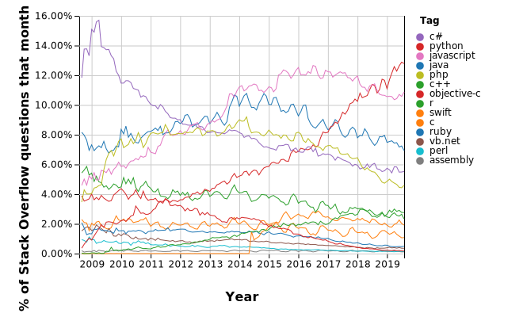

# Python

According to [Stack Overflow](https://insights.stackoverflow.com/trends?tags=java%2Cc%2Cc%2B%2B%2Cpython%2Cc%23%2Cvb.net%2Cjavascript%2Cassembly%2Cphp%2Cperl%2Cruby%2Cvb%2Cswift%2Cr%2Cobjective-c) Python is the most popular programming language.

