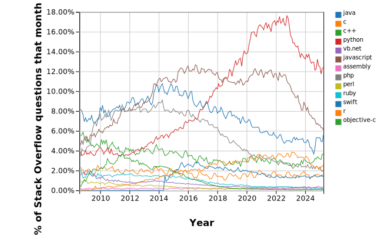

# 

Python is an interpreted, high-level, general-purpose programming language. Created by Guido van Rossum and first released in 1991, Python's design philosophy emphasizes code readability. Its language constructs and object-oriented approach aim to help programmers write clear, logical code for small and large-scale projects. It supports multiple programming paradigms, including procedural, object-oriented, and functional programming. Python is often described as a "batteries included" language due to its comprehensive standard library.

According to [Stack Overflow](https://insights.stackoverflow.com/trends?tags=java%2Cc%2Cc%2B%2B%2Cpython%2Cc%23%2Cvb.net%2Cjavascript%2Cassembly%2Cphp%2Cperl%2Cruby%2Cvb%2Cswift%2Cr%2Cobjective-c) Python is the most popular programming language.

## What's here
* **Code** - Until we have a need to start sorting code into categories, it can all go into this folder! Upload anything you are using or find useful.
  * Useful scripts
  * Interesting discoveries
  * Your favourite use cases / output
* Helpful links and use case ideas
  
[See our Guide](https://github.com/Sopwith/IR/blob/master/Guide.md#how-to-contribute-your-own-creations) for tips on uploading your own submissions / content. 

## How to Download a file
You can easily download or work with files by creating your own clone or fork of parts of the CIRPA repository. But if you just want to download a single file:
1. Click on the file/script you want.
2. Right-click the "Raw" button on the top of the file's text box interface.

3. Click "Save link as..." (or equivalent in your browser) to save the file/script and use it.
## Getting Started in Python
* [Python.org](https://www.python.org/)
* [Anaconda](https://www.anaconda.com/) - a good way to install scientific (aka data science) Python on your machine
* [Python Cheatsheet](https://github.com/BisratYalew/python-cheatsheet)

## Helpful Links / Interesting Ideas
* [Automate the Boring Stuff with Python](https://automatetheboringstuff.com/): A great practical guide to learning Python with small examples and use cases.
* Bokeh - Interactive Visualizations, with examples: https://docs.bokeh.org/en/latest/docs/gallery.html#gallery 
*Related:* Dashboarding Tools from PyViz: https://pyviz.org/dashboarding/index.html 
* *[Recent Anaconda Webinar about Panel](https://event.on24.com/interface/registration/autoreg/index.html?eventid=2044361&sessionid=1&key=9B446BD2ECD02D63B2CD6D0075D52A6C)*
* Use Python to conduct transactions (make [requests](https://realpython.com/python-requests/)) between web systems using APIs. (Eg. [Qualtrics](https://api.qualtrics.com/))

### PyCon Canada
[PyCon Canada](https://2019.pycon.ca/) will be held in Toronto on November 16-19
and it will feature a **PyData** track,
so there will be plenty of content for IR folks using Python.
